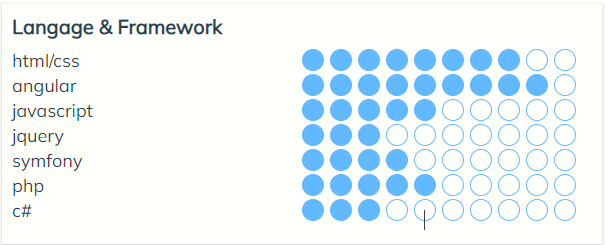

### sgjs Version 1

Look how to use this module

---


- 1.First of all, you must declare in your HTML page the block
 like that:
   `<div id="app"></div>`
- . Second, you can put your code in javascript.
   Look at the code :

``` script
(function(){
    Jc.option({
        color: "#FFA07A", frame:"cercle",
        ladder:10, speed:1000,
        number: 5, selected:'app'
    }).add('Langage & Framework', [
        {name:'html/css', level: 8},{name:'angular', level:9},
        {name:'javascript', level:5},{name:'jquery', level:3},
        {name:'symfony',level:4}, {name:'php', level:5},
        {name:'c#', level:3}
    ]).animate();
})();
```

Function uses
-----------------------

>The utility functions of the module.

| Function                    | Description                |
| --------------------------- | -------------------------- |
| Jc.add()                    | Function addBloc           |
| Jc.animate()                | Function animate           |
| Jc.option(<Element option>) | Function de configurations |

```
sgjs module:
    - https://www.manzowa.com/sgjs